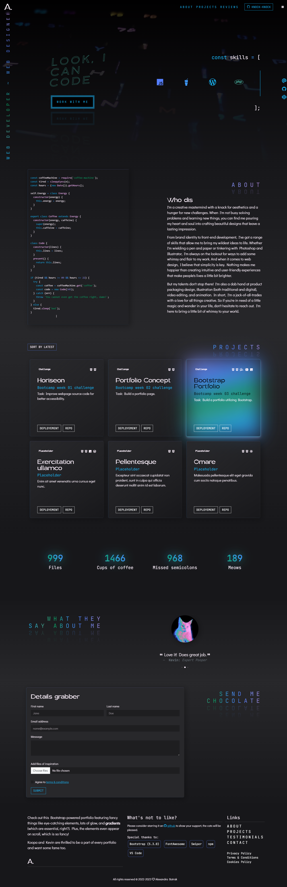

# Bootstrap-powered portfolio

## About

Bootcamp week 03: Bootstrap challenge: Build a portfolio page. :black_heart:

~~Recreation~~ New style portfolio utilizing Bootstrap 5.3.0-alpha1, Swiper.js, and Purecounter.

## Feautres

- [x] Bootstrap-powered HTML structure containing sections: about, projects list, counter feature, testimonials and contact
- [x] On-page responsive navigation bar with on-scroll behaviour
- [x] A hero section featuring a video background
- [x] Fully Responsive layout
- [x] Animations: on scroll appearance, marquee, typing effect
- [x] Modal contact form + on-page section for accessibility
- [x] Auto-turn animations and moving elements for users on devices with defined preferences
- [x] Accessible integration of FontAwesome

## [View Project](https://alexandrabatrak.github.io/bootstrap-portfolio/)

## Credits

- [Unsplash](https://unsplash.com/) for main video background.
- [WCAG Contrast Checker](https://webaim.org/resources/contrastchecker/)
- [WAVE Web accessibility evaluation tool](https://wave.webaim.org/)
- [BunnyFonts](https://fonts.bunny.net/). :rabbit2: [The Didact Gothic Project Authors](mailto:il.basso.buffo@gmail.com) || [The JetBrains Mono Project Authors](https://github.com/JetBrains/JetBrainsMono)
- [Gebril Font](https://www.creativefabrica.com/product/gerbil/ref/78781/)
- [FontAwesome](https://fontawesome.com/)
- [Swiper slider](https://swiperjs.com/get-started)
- [Purecounter](https://github.com/srexi/purecounterjs)
- [Prism code highlighting](https://prismjs.com/)

JS snippets from:

- [On-scroll animations](https://dev.to/miacan2021/fade-in-animation-on-scroll-with-intersectionobserver-vanilla-js-4p27)
- [Skills list scroll animation](https://codepen.io/tmhrtwg/pen/PvywxY) (// Edited to fix error with negative margin and first element never appending to the last correctly.)

CSS CTA button inspired by:

- [Carlos Ortega](https://codepen.io/Carlos1162/pen/eJdLXa)

## License

Licenced under the [MIT](/LICENSE) license.

_Copyright © 2023 Alexandra Batrak_
